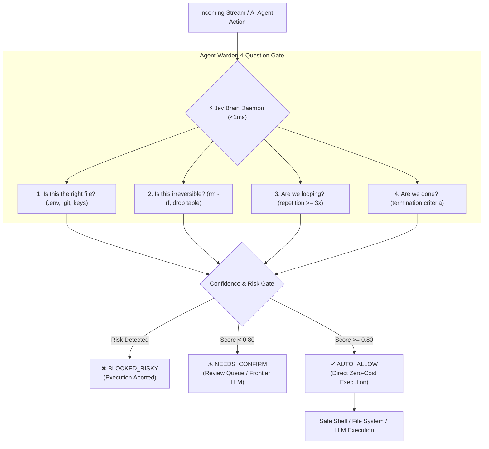

<div align="center">


# ⚡ JEV BRAIN
### Universal Pre-Execution AI Firewall & Sub-Millisecond Decision Daemon

> **“Don’t think. Route. Don't crash. Ward.”**  
> An ultra-fast (< 1ms), zero-heavy-weights safety firewall and router for AI agents, CI/CD pipelines, and LLM applications.

[](https://jevbrain.world)
[](https://github.com/marketplace/actions/jev-agent-warden-ai-safety-ci-firewall)
[](https://github.com/Synxneuos/jevbrain/actions)
[](https://dexscreener.com/solana/AxwSUUHx6hj8bgdtSxVUiKtKkZwmcDbNbEEtTvzfpump)
[](https://opensource.org/licenses/MIT)
[]()
[]()

<br/>

### 🌐 Official Website & Live DApp
👉 **[https://jevbrain.world](https://jevbrain.world)**

<br/>

### 🪙 Official Solana Contract Address (CA)
```text
AxwSUUHx6hj8bgdtSxVUiKtKkZwmcDbNbEEtTvzfpump
```
[🌐 Live DApp: jevbrain.world](https://jevbrain.world) • [📊 Live Chart on DexScreener](https://dexscreener.com/solana/AxwSUUHx6hj8bgdtSxVUiKtKkZwmcDbNbEEtTvzfpump) • [💊 Trade on Pump.fun](https://pump.fun/coin/AxwSUUHx6hj8bgdtSxVUiKtKkZwmcDbNbEEtTvzfpump) • [💬 Official Discord](https://discord.gg/yfvDARvRb)

<br/>

[Live DApp](https://jevbrain.world) • [Quickstart](#-30-second-integration-recipes) • [GitHub Action](#1--github-actions-ci-firewall-3-lines) • [SDK Wrapper](#2--universal-openai--anthropic-sdk-wrapper-1-line) • [Git Hook](#3--1-command-git-pre-commit-guard) • [Architecture](#-architecture) • [Benchmarks](#-benchmarks) • [Tokenomics & CA](#-token-utility--contract-address)

</div>

---

## 💡 The Core Problem

Autonomous coding agents (Devin clones, SWE-bench, Claude Engineer, AutoGPT) and LLMs are brilliant at reasoning, but **perilous at execution**:
1. **Destructive Command Execution**: One hallucinated `rm -rf`, unconstrained `git reset --hard`, or `DROP TABLE` can wipe databases or production code.
2. **Credential Leaks**: Agents accidentally reading or staging `.env`, SSH keys, or `.pem` certificates into public commits.
3. **Runaway Loops & Token Waste**: Agents repeating identical failing bash tool calls 10+ times, burning \$0.03 per call and stalling.
4. **Heavy Guardrail Bloat**: Existing guardrail libraries (Guardrails AI, LangChain Evaluators) take **2,000ms - 5,000ms** and cost \$0.02 per check because they invoke yet another heavy LLM to check the first LLM!

### The Jev Brain Solution
**Jev Brain** executes **sub-millisecond local pre-execution triage (< 1ms)** using zero-weight heuristic classifiers, cryptographic memory, and pattern safety engines:
- **Decision $\ge$ 0.80** $\rightarrow$ **`AUTO_ACT` / `AUTO_ALLOW`** (Instant zero-cost pass)
- **Decision $<$ 0.80** $\rightarrow$ **`REVIEW_QUEUE` / `NEEDS_CONFIRM`** (Escalate to Human / Frontier model)
- **Destructive / Protected** $\rightarrow$ **`BLOCKED_RISKY`** (Hard block before the OS shell ever spawns)

---

## ⚡ 30-Second Integration Recipes

### 1. 🛡️ GitHub Actions CI Firewall (3 Lines)
Add pre-execution safety to any GitHub repository or AI agent pull request workflow. Blocks destructive bash scripts, `.env` leaks, and dangerous PR commits in CI:

```yaml
# .github/workflows/agent-warden.yml
- name: Jev Agent Warden CI Firewall
  uses: Synxneuos/jevbrain@main
  with:
    tool: bash
    command: ${{ steps.agent.outputs.command }}
    fail-on-risk: true
```

### 2. ⚡ Universal OpenAI / Anthropic SDK Wrapper (1 Line)
Drop-in wrapper that automatically intercepts tool calls, eliminates prompt bloat, and provides 0ms semantic caching:

```typescript
import OpenAI from 'openai';
import { wrapOpenAI } from 'jev-brain';

// Wrap any standard OpenAI instance
const openai = wrapOpenAI(new OpenAI({ apiKey: process.env.OPENAI_API_KEY }), {
  warden: true,   // Blocks destructive tool calls (rm -rf, protected paths)
  cache: true,    // 0ms Semantic Cache (100% token savings on repeat queries)
  compress: true  // Prunes 35-50% redundant whitespace & token bloat
});

// Use openai exactly as normal — pre-execution safety is transparent!
const completion = await openai.chat.completions.create({
  model: 'gpt-4o',
  messages: [{ role: 'user', content: 'Audit database performance' }]
});
```

### 3. 🪝 1-Command Git Pre-Commit Guard
Never accidentally commit `.env`, SSH keys, or destructive agent scripts to GitHub again:

```bash
# Installs .git/hooks/pre-commit in 1 second
npx jev-brain hook install

# Verify staged files anytime
npx jev-brain hook check
```

### 4. 💻 Instant CLI Security Audit & Pre-Flight Check
Run instant pre-flight checks directly from your terminal:

```bash
# Pre-flight check on any command before execution (<1ms)
npx jev-brain warden --tool bash --command "rm -rf /"

# Deep scan of entire codebase for secrets and unconstrained scripts
npx jev-brain audit .

# Fast stream routing
npx jev-brain route "Emergency: Payment webhook returning 502" --preset inbox
```

### 5. 🔌 Universal Express / Fastify / Node Middleware
Triage incoming webhooks or user prompts before expensive backend processing:

```typescript
import express from 'express';
import { jevMiddleware } from 'jev-brain/middleware';

const app = express();
app.use(express.json());

// Attach instant triage (<1ms) & Agent Warden pre-flight protection
app.use(jevMiddleware({ preset: 'inbox', warden: true }));

app.post('/api/agent-hook', (req, res) => {
  console.log(req.jev.action);     // 'AUTO_ACT' | 'REVIEW_QUEUE'
  console.log(req.jev.confidence); // 0.94
  res.json({ status: 'processed', jev: req.jev });
});
```

### 6. 🐍 Python AI Agents (LangChain / CrewAI / AutoGen)
Integrate with Python AI agents via sub-millisecond local REST query:

```python
import requests

def safety_gate(command: str) -> bool:
    res = requests.post("http://localhost:3333/api/warden", json={"command": command}).json()
    if res["decision"] == "BLOCKED_RISKY":
        raise PermissionError(f"Blocked by Jev Agent Warden: {res['reasons']}")
    return True
```

---

## 🏗️ Architecture



---

## 📊 Benchmarks

Why developers choose **Jev Brain** over traditional guardrails:

| Feature | Jev Brain ⚡ | Guardrails AI | LangChain Evaluators | PromptFoo |
| :--- | :---: | :---: | :---: | :---: |
| **Pre-Flight Latency** | **< 1ms** | 1,800ms – 3,500ms | 2,500ms – 4,000ms | N/A (Test only) |
| **Per-Check Cost** | **$0.00 (Local)** | $0.015 – $0.030 | $0.020 – $0.040 | $0.00 |
| **Memory Footprint** | **< 15 MB** | > 450 MB | > 600 MB | ~80 MB |
| **GitHub Marketplace Action** | **Yes (`action.yml`)** | No | No | Custom Action |
| **Git Pre-Commit Hook** | **Built-in (`1-line`)** | Manual script | None | None |
| **Tool Call Interceptor** | **Yes (Automatic)** | Python Only | Complex chain | None |
| **Semantic Response Cache** | **Level 0 (0.1ms)** | Extra dependency | Extra plugin | None |
| **Android Device Gateway** | **Yes (Mobilerun)** | None | None | None |

---

## 🛡️ Agent Warden: The 4 Critical Questions

Every tool call, file write, or bash script evaluated by **Agent Warden** answers 4 pre-flight questions before permission is granted:

| # | Question | Verification Scope | Action on Failure |
| :-: | :--- | :--- | :--- |
| **1** | **Is this the right file?** | Protects `.env`, `.git/`, `id_rsa`, `*.pem`, root system paths, and lockfiles from unauthorized reads/writes. | **`BLOCKED_RISKY`** |
| **2** | **Is this irreversible?** | Intercepts `rm -rf`, `DROP TABLE`, `delete from`, `mkfs`, `format`, `git reset --hard`, and force pushes. | **`BLOCKED_RISKY`** |
| **3** | **Are we looping?** | Tracks rolling execution history signature window ($n=6$) to catch agent infinite repeating failure loops ($\ge 3\times$). | **`NEEDS_CONFIRM`** |
| **4** | **Are we done?** | Heuristically inspects tool output for completion criteria to stop token bleed. | **`AUTO_ALLOW`** |

---

## 📱 Jev Mobile Runner (Autonomous Android Device Gateway)

Operates connected Android devices natively via ADB / Mobilerun protocol with pre-flight Agent Warden protection:
- **Interactive Web Mirror:** Real-time phone mirror with direct click-to-tap, drag-to-swipe, and Android navigation keys (`Back`, `Home`, `Recents`).
- **Command Injection Hardened:** Built with direct `execFileSync` binary invocation and strict regex parameter sanitization.
- **Dual Mode:** Seamlessly bridges to physical USB/WiFi ADB devices or spins up an interactive Virtual Android Device (`Pixel 8 Pro - Android 14`).

```bash
# List physical and virtual devices
npx jev-brain mobile devices

# Execute touch gesture with safety gate
npx jev-brain mobile tap 540 1200

# Inspect active foreground app and UI hierarchy
npx jev-brain mobile inspect
```

---

## 🌐 Web Dashboard & REST API

**Official Live Web DApp:** [https://jevbrain.world](https://jevbrain.world)

Launch the real-time Kanban decision dashboard, interactive Agent Warden test bench, and model matrix locally:

```bash
npm start
# or: npx jev-brain serve --port 3333
```
Open **`http://localhost:3333`** to access:
- **Live Stream Kanban**: Real-time triage with instant confidence meters.
- **Agent Warden Test Bench**: Interactive pre-flight command tester with live badges.
- **Dynamic Tier Matrix**: Dynamic DexScreener liquidity tiers & MetaMask cryptographic signing.
- **Mobile Device Mirror**: Interactive virtual Android touch canvas.

### REST Endpoints
- `POST /api/warden` — Run pre-flight safety gate on command/file
- `POST /api/route` — Classify text input with confidence score
- `POST /api/batch` — Batch process stream items
- `POST /api/chat` — Authenticated AI streaming with session token protection
- `GET  /api/stats` — Real-time latency, throughput, and dollars saved

---

## 💎 Token Utility & Contract Address

- **Official Token Contract Address (CA — Solana / Pump.fun)**:
  ```text
  AxwSUUHx6hj8bgdtSxVUiKtKkZwmcDbNbEEtTvzfpump
  ```
  [](https://dexscreener.com/solana/AxwSUUHx6hj8bgdtSxVUiKtKkZwmcDbNbEEtTvzfpump)

- **Tiered Multi-Agent Access**: Holding verified Jev Brain tokens unlocks advanced model routing, higher autonomous throughput limits, and enterprise-grade Agent Warden rule filters.
- **Holder Rewards Protocol**: A dedicated on-chain reward and protocol revenue-sharing mechanism is architected into the ecosystem. The reward distribution engine will be activated in an upcoming phase for all verified holding wallets.

---

## 👥 Core Contributors & Maintainers

- **Synxneuos** ([@Synxneuos](https://github.com/Synxneuos)) — Lead Maintainer & Architecture
- **Claude** ([@claude](https://github.com/claude)) — Autonomous Core Engine & Benchmark Systems

Contributions, feature requests, and security suggestions are warmly welcomed via GitHub Issues and Pull Requests.

**License:** [MIT](LICENSE)
